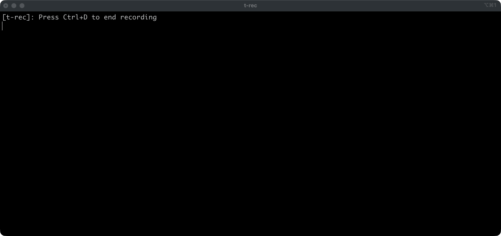

# jobs_logger

Two modes: tail CloudWatch for a running AWS Batch job, or fire the podscribe-jobs GitHub Action that builds a test image from a non-master branch.

```
-logs     pick a RUNNING job, follow logs
-build    dispatch "Build job image (manual test)" for the job dir you're in
-marker   substring in the job definition name (logs only)
-platform linux/arm64 (default) or linux/amd64 (build only)
```

Exactly one of `-logs` / `-build`.

Needs AWS credentials for `us-east-1` (`~/.aws` or env) and the GitHub CLI (`gh`) installed and logged in. `-logs` uses `gh api user` for the default marker. `-build` uses `gh workflow run` against `podible/podscribe-jobs`.

```bash
cd ~/podscribe/jobs_logger && make install
```

That puts `jobs_logger` in `~/.local/bin`. Rebuild the same way after pulling.

## logs

Looks at active job definitions whose name contains `-marker`, then lists RUNNING jobs on those defs across all queues. Default marker is your GitHub login:

```bash
jobs_logger -logs
jobs_logger -logs -marker SomeOtherLogin
```

Arrow keys, enter. It follows the CloudWatch stream (`/aws/batch/job` unless the container overrides the group) until the job is no longer running.



## build

cwd has to be under `podscribe-jobs/jobs/<dir>/` (the dir with the Dockerfile). The git branch you're on is what gets built — push it first, `workflow_dispatch` needs the ref on origin.

```bash
cd ~/podscribe/podscribe-jobs/jobs/compute_incrementality
jobs_logger -build
jobs_logger -build -platform linux/amd64
```

It finds a prod job definition named `podscribe-jobs-<dir>` (`_` and `-` swapped if needed), copies ECR repo from that def's image, and prints the Actions URL.
